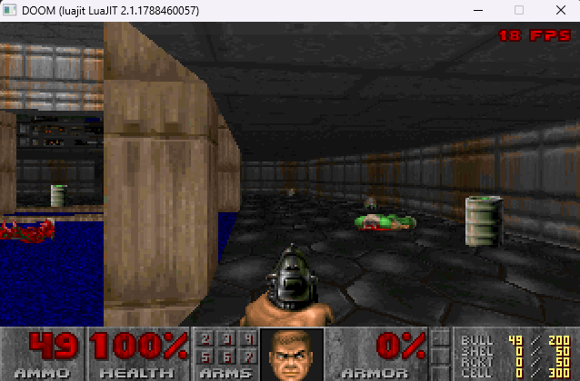

# lua_doom



**Vídeo:** [DOOM rodando em Lua](https://youtu.be/4OYTretHKtY)

DOOM generic portado de **[python_doom](https://github.com/vagucs/python_doom)** para **Lua 5.4 e LuaJIT + SDL2**.

Por **Wagner Nunes da Silva**

- vagucs@bol.com.br
- vagucs@vagucs.com.br
- vagucs@gmail.com
- [www.vagucs.com.br](https://www.vagucs.com.br)
- [LinkedIn](https://www.linkedin.com/in/wagner-nunes-da-silva-b0a15360)

O mesmo fonte roda no Lua 5.4 da PUC-Rio e no LuaJIT. O laço, o mapa e o renderer ficam em Lua. A SDL2 fica atrás de uma API só. O LuaJIT chama a `SDL2.dll` pela FFI. O Lua 5.4 usa uma ponte pequena em C (`src/video_c.c`).

English version: [README.md](README.md)

---

## Como executar

Ferramentas, já instaladas no MSYS2 UCRT64:

| Runtime | Executável |
| --- | --- |
| Lua 5.4.9 (PUC-Rio) | `C:\msys64\ucrt64\bin\lua5.4.exe` |
| LuaJIT 2.1 | `C:\msys64\ucrt64\bin\luajit.exe` |
| SDL2 | `C:\msys64\ucrt64\bin\SDL2.dll` |

```
run.bat
run.bat jit
```

`run.bat` abre a janela com o Lua 5.4. `run.bat jit` abre a mesma cena com o LuaJIT. Os dois aceitam os parâmetros depois: `run.bat -warp 1 1 -skill 2` e `run.bat jit -warp 1 1`. O título toca música. Esc ou Enter abre o menu. A skill abre a vista, sem derreter, e a música da fase fica em loop. A barra de baixo mostra vida, munição, armas, chaves e o rosto. Setas andam e viram, Shift corre, Ctrl atira, Espaço usa. O mouse olha e o botão esquerdo atira. `-` e `=` mudam o tamanho da tela; no automapa, aproximam. Tab abre o mapa, `f` segue o jogador, `g` liga a grade, `0` mostra o mapa inteiro. O tiro, a porta e o monstro tocam o efeito. Os inimigos olham, perseguem e caem. A chave no chão abre a porta trancada. O interruptor de saída derrete a tela para a contagem e segue para a fase seguinte. No fim do episódio o texto sobe no flat e, no Enter, volta ao título. Save e Load usam `doomsav0.dsg` até `doomsav5.dsg`, ao lado do IWAD. Os cheats são os de sempre: `iddqd`, `idkfa`, `idfa`, `idclip`, `idspispopd`, `iddt`, `idbehold`, `idchoppers`, `idmypos`, `idclev` e `idmus`. `-fps` escreve os quadros, `-crt` liga o tubo. Sair está no item do menu, ou no fechar da janela. A recompilação da ponte, só quando `src\video_c.c` muda, é `build_video.bat`.

O motor é escrito no dialeto comum (Lua 5.1). Sem `//`, sem `&` `|` `<<` `>>`, sem `ffi` fora de `video_ffi.lua`. Índice de WAD, BSP e menu continua 0-based no dado e é lido com `+ 1`.

Cada fase abaixo depende da anterior. O código de referência é `python_doom/doom/`.

## Fases

1. **Compat.** Feito. `compat.lua` segue `compat.py`. `fixed_mul` parte em metades de 16 bits. `band` / `bor` / `bxor` / `shl` usam `bit.*` no LuaJIT e os operadores do Lua 5.4, carregados com `load` para o LuaJIT não analisar esse texto. Os dois executáveis passam em `test_compat.lua`.

2. **WAD.** Feito. `wad.lua` segue `wad.py`. O número do lump continua 0-based. `PLAYPAL` (10752 bytes) e `TITLEPIC` (68168) saem do `DOOM1.WAD` nos dois executáveis, via `test_wad.lua`. Sem janela.

3. **Janela.** Feito. `video.lua` escolhe o backend. `video_ffi.lua` no LuaJIT. `src/video_c.c` no Lua 5.4, em `video_c.dll`. Os dois abrem 640×400, esticam o framebuffer de 320×200 e leem o teclado. Esc fecha.

4. **Título.** Feito. `v_video.lua` segue `v_video.py`. `run.bat` mostra o `TITLEPIC` com a primeira `PLAYPAL`.

5. **Laço e menu.** Feito. `main.lua` acumula `SDL_GetTicks` e chama o menu a 35 Hz. `menu.lua` segue `menu.py`. Esc ou Enter abre. Setas, Enter e Backspace navegam. No shareware o episódio aparece mesmo sem `E2M1`; os episódios 2 a 4 avisam a versão registrada. A skill escolhida escreve `EPISODIO n SKILL n` e o mapa não entra. Som fica mudo até a fase 12. Os dois executáveis passam em `test_menu.lua`.

6. **Mapa.** Feito. `world.lua` segue `world.py`. `E1M1` sai com 467 vértices, 475 linhas, 732 segs, 236 nodes, blockmap 36×23 e reject de 904 bytes, iguais ao Python. A skill limpa o menu e desenha as linhas vistas de cima, com a seta do jogador. O nome da textura fica guardado; o número entra na fase 7. Os dois executáveis passam em `test_world.lua`.

7. **Texturas.** Feito. `r_data.lua` segue `r_data.py`. O shareware tem 125 texturas e 56 flats. `STARTAN2` é a textura 69, `FLOOR4_8` é o flat 10, `COLORMAP` tem 8704 bytes. A coluna composta de `BIGDOOR1` bate com o Python. A planta pinta cada linha com a cor mais comum da textura da parede, ou do flat do chão quando a linha não tem textura. Sprites ficam para a vista. Os dois executáveis passam em `test_r_data.lua`.

8. **Vista.** Feito. `render.lua` segue `render.py`, `tables.lua` segue `tables.py` e `sprites.lua` segue o desenho de `sprites.py`. No `E1M1`, de pé no ponto de partida e na skill média, o framebuffer de 320×200 é igual ao Python: 34 paredes, 100 planos, 91 coisas. A faixa de baixo fica vazia, no lugar da barra. Andar fica para a fase 9. Os dois executáveis passam em `test_view.lua`.

9. **Jogador.** Feito. `player.lua` segue `player.py` e `collision.lua` segue o movimento, o uso e o tiro de `collision.py`. No `E1M1`, 35 tics andando para a frente param no mesmo ponto do Python, com a mesma velocidade. A pistola sobe na frente da vista e o quadro com ela é igual ao Python. Ctrl gasta um pente e o hitscan tira a mesma vida. A porta abre na fase 10. Os dois executáveis passam em `test_player.lua`.

10. **Setores.** Feito. `specials.lua` segue `specials.py`. No `E1M1`, a primeira porta sobe de 0 a 3932160 em 30 tics, as luzes batem com o Python e o interruptor de saída troca a textura 100 pela 119. A saída desenha o `WIMAP0` e, no Enter ou depois de quatro segundos, entra na fase seguinte com a vida e as armas. A contagem e o melt ficam para a fase 13. A chave no chão abre a porta trancada. Os dois executáveis passam em `test_specials.lua`.

11. **Inimigos.** Feito. `enemy.lua` segue `enemy.py` e `thinker.lua` segue `thinker.py`. No `E1M1`, 20 tics parado, os monstros ficam no mesmo lugar e no mesmo quadro do Python. Um zumbi morto cai no `POSS` quadro 12, com altura 917504. O foguete, o plasma e o BFG saem da arma. O som continua mudo. Os dois executáveis passam em `test_enemy.lua`.

12. **Som.** Feito. `sound.lua` segue `sound.py` e `mus2mid.lua` segue `mus2mid.py`. O `D_E1M1` vira o mesmo MIDI do Python, 23334 bytes. O `DSPISTOL` vira as mesmas 5629 amostras. A ponte enfileira o PCM a 11025 Hz e o MIDI sai pelo MCI do Windows. O título toca `D_INTROA` no shareware. O `E1M1` fica em loop no `D_E1M1`. O tiro, a porta e o monstro tocam o `DS*`. Se a placa não abre, o jogo segue mudo. Os dois executáveis passam em `test_sound.lua`.

13. **Barra, intermissão e melt.** Feito. `status.lua` segue `status.py`, `wi_stuff.lua` segue `wi_stuff.py` e `wipe.lua` segue `wipe.py`. A faixa de baixo mostra vida, munição, armas, chaves e o rosto, no mesmo desenho do Python. Ao sair da fase a tela derrete para a contagem: kills, itens, segredos, tempo e par. Enter, Espaço ou Ctrl aceleram e seguem para o mapa seguinte, que também derrete. Abrir um jogo novo a partir do título não derrete. A música da contagem é `D_INTER`. Os dois executáveis passam em `test_hud.lua`.

14. **Resto do python_doom.** Feito. `am_map.lua` segue `am_map.py`, `finale.lua` segue `finale.py`, `saveg.lua` segue `saveg.py` e `cheats.lua` segue os cheats de `game.py`. Tab abre o automapa. O mapa 8 do shareware escreve o `E1TEXT` em `FLOOR4_8` e derrete para a arte. Save e load gravam `doomsavN.dsg` com o cabeçalho `DOOMPY01`. O mouse entra na `ticcmd`. `-warp`, `-skill`, `-file`, `-iwad`, `-nomonsters`, `-fast`, `-respawn`, `-nosound`, `-nomusic`, `-fps` e `-crt` saem de `game.py`. `-` e `=` mudam o tamanho da vista. Os dois executáveis passam em `test_phase14.lua`.

Fora do corte do `python_doom`: rede, joystick, CD-Audio.

---

## Doe

### Ethereum

`0x1b64038A2b1DB73ABd0068d8B9B0d1dC5a90C5F1`


### PIX

Chave: `vagucs@bol.com.br`


